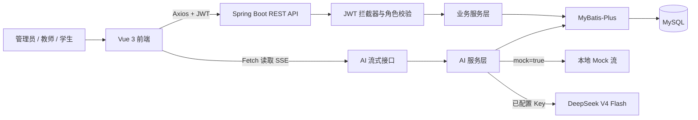
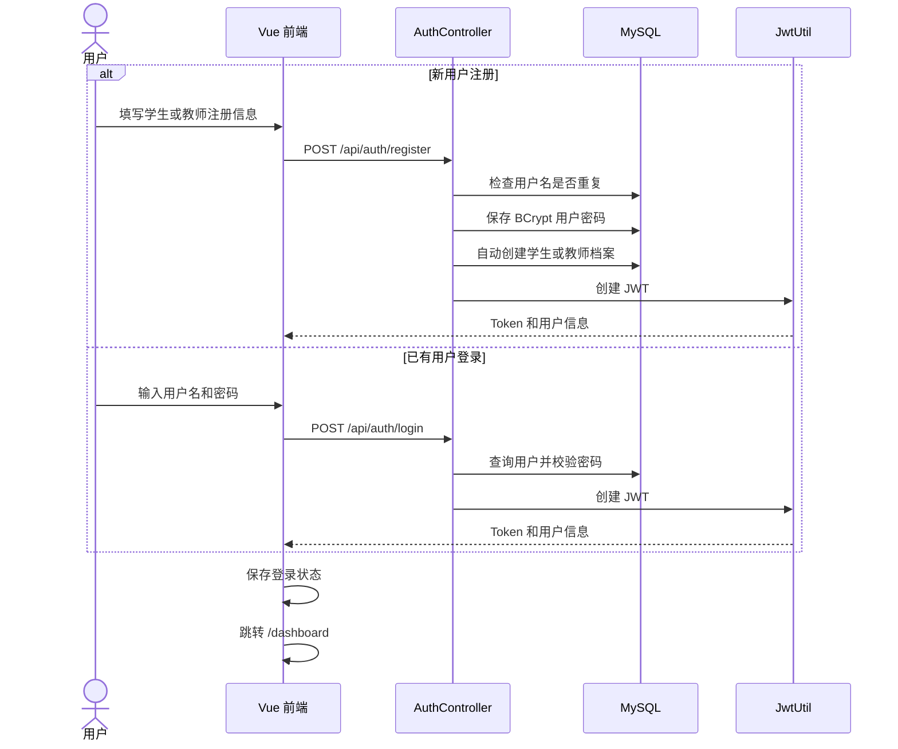
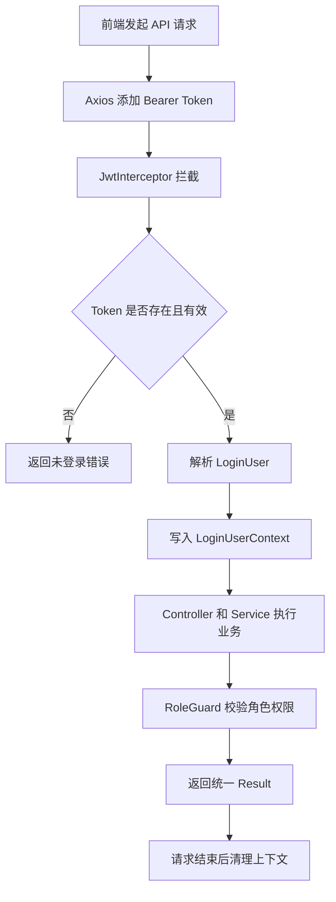
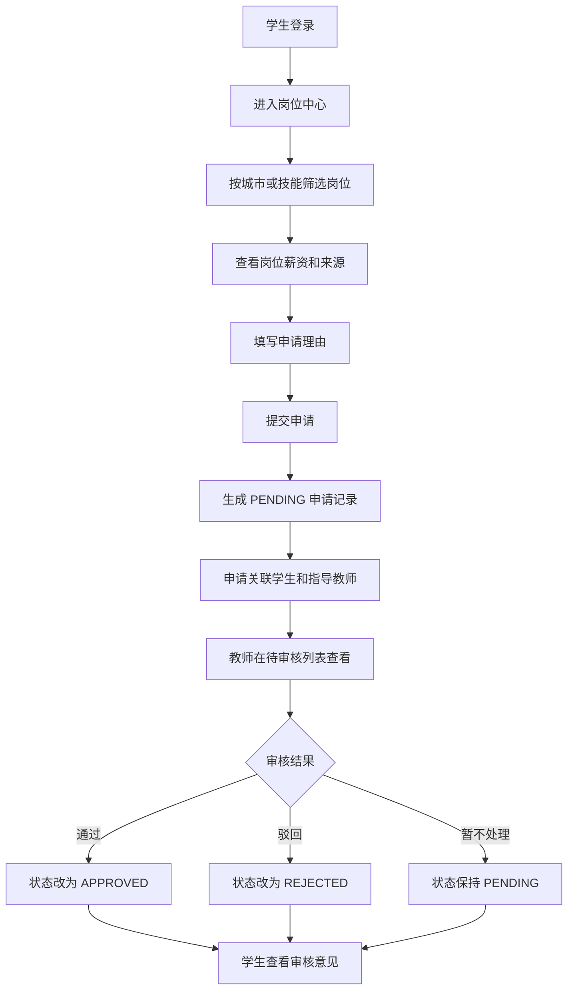
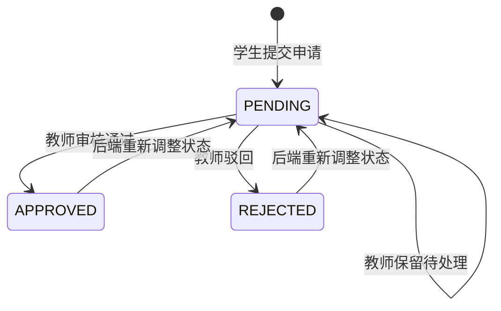
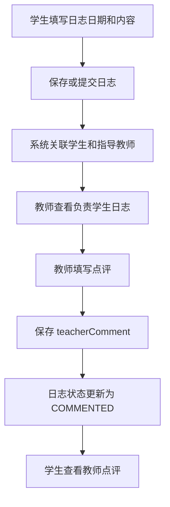
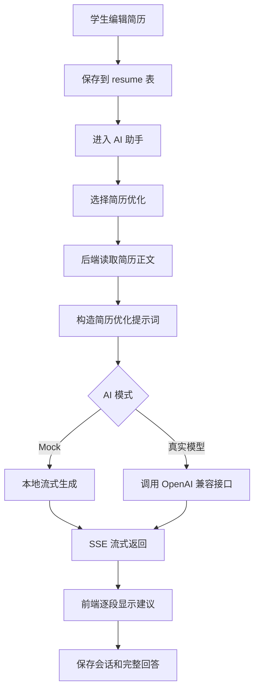
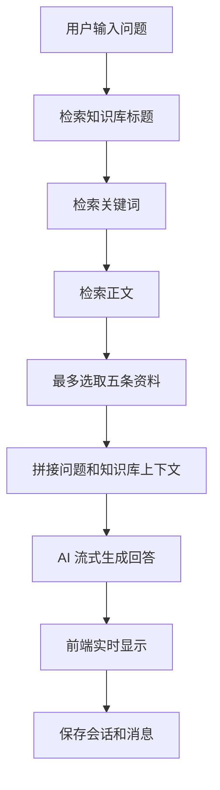
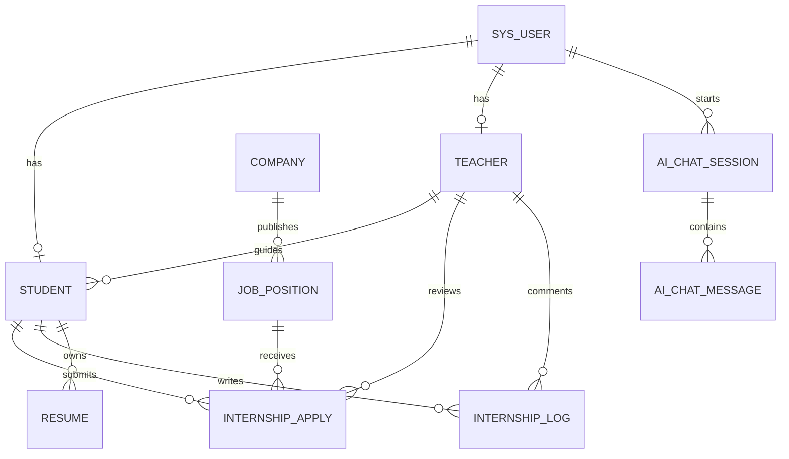

# InternAI AI 实习就业助手——项目功能与业务流程

## 1. 文档说明

本文档依据当前项目代码编写，用于介绍 InternAI AI 实习就业助手的项目定位、用户角色、功能模块、业务流程、系统调用过程、数据库结构、接口设计及答辩演示流程。

项目采用前后端分离架构，面向高校实习管理和学生求职辅助场景，将岗位浏览、实习申请、教师审核、实习日志、简历管理、知识库问答和 AI 求职辅导整合到一个系统中。

## 2. 项目概述

### 2.1 项目名称

InternAI Career Assistant / AI 实习就业助手。

### 2.2 项目目标

项目主要解决以下问题：

1. 学生获取岗位信息的渠道分散，难以根据个人技能和意向城市快速筛选岗位。
2. 实习申请、教师审核和实习过程记录缺少统一的线上流程。
3. 学生简历内容质量参差不齐，缺少结构化的优化建议。
4. 教师难以及时查看自己负责学生的申请和实习日志。
5. 校内实习制度、申请流程和就业指导资料查询效率较低。
6. 传统系统交互以静态表单为主，缺少流式 AI 辅助能力。

### 2.3 核心特点

- 基于 `ADMIN`、`TEACHER`、`STUDENT` 三种角色进行权限控制。
- 使用 JWT 完成无状态登录鉴权。
- 使用 MyBatis-Plus 完成分页查询和业务数据持久化。
- 仪表盘聚合岗位、申请、简历、知识库和用户档案数据。
- 岗位数据包含来源名称、来源链接和核验日期。
- 岗位匹配度由学生技能和意向城市动态计算，不使用固定百分比。
- AI 功能通过 SSE 以打字机效果流式返回。
- 默认接入价格较低的 `deepseek-v4-flash`，API Key 从环境变量读取。
- 未配置 DeepSeek API Key 时自动回退到 AI Mock 模式，无 Key 也能完成演示。

## 3. 技术架构

### 3.1 技术栈

| 层级 | 使用技术 | 主要职责 |
| --- | --- | --- |
| 前端 | Vue 3、Vite、Element Plus | 页面渲染、表单交互、数据展示 |
| 前端状态 | Pinia | 保存登录用户和角色信息 |
| 前端路由 | Vue Router | 页面导航、登录拦截、角色路由控制 |
| HTTP 请求 | Axios、Fetch | 普通接口请求和 SSE 流式读取 |
| 后端 | Spring Boot 3.3.5、JDK 17 | REST API、业务处理、权限校验 |
| 数据访问 | MyBatis-Plus | 分页、查询、保存、更新和删除 |
| 数据库 | MySQL 8 | 用户、岗位、申请、日志、简历等数据持久化 |
| 鉴权 | JWT、BCrypt | 登录令牌、密码加密、身份解析 |
| AI | Spring WebFlux、DeepSeek OpenAI 兼容接口 | DeepSeek V4 Flash、流式生成、Mock 回退、会话记录 |

### 3.2 系统架构图



### 3.3 前后端调用链

```text
页面组件
  → frontend/src/api 或 frontend/src/utils/request.js
  → Axios 请求拦截器自动添加 Authorization 请求头
  → Spring Boot Controller
  → JwtInterceptor 解析登录用户
  → RoleGuard 校验角色
  → Service 执行业务规则
  → MyBatis-Plus Mapper
  → MySQL
  → Result<T> 统一响应
  → Axios 响应拦截器提取 data
  → Vue 更新页面状态
```

## 4. 用户角色与权限

### 4.1 管理员 ADMIN

管理员负责系统基础数据维护，主要功能包括：

- 查看聚合仪表盘。
- 管理系统用户。
- 管理学生档案。
- 管理教师档案。
- 管理企业信息。
- 新增、编辑和删除岗位。
- 维护岗位来源、来源链接和核验日期。
- 管理知识库资料。
- 使用模拟面试和知识库问答等 AI 工具。
- 通过后端接口查看和处理申请、日志数据。

### 4.2 指导教师 TEACHER

教师负责学生实习过程指导，主要功能包括：

- 查看聚合仪表盘。
- 浏览开放岗位和企业信息。
- 查看学生档案。
- 查看自己负责学生的实习申请。
- 通过或驳回学生申请，并填写审核意见。
- 查看自己负责学生的实习日志。
- 点评实习日志。
- 使用模拟面试和知识库问答工具。

教师不能审核其他教师负责的学生申请，也不能点评其他教师负责学生的日志。

### 4.3 学生 STUDENT

学生是求职和实习流程的主要参与者，主要功能包括：

- 注册、登录和查看个人信息。
- 查看秋招仪表盘。
- 浏览开放岗位、薪资、技能要求和岗位来源。
- 根据技能和意向城市查看岗位匹配度。
- 跳转到岗位原始来源页面。
- 提交岗位申请和申请理由。
- 查看自己的申请状态及教师意见。
- 新建、修改和提交实习日志。
- 查看教师日志点评。
- 编辑个人简历和附件链接。
- 使用 AI 简历优化、岗位推荐、模拟面试和知识库问答。

### 4.4 权限矩阵

| 功能 | 管理员 | 教师 | 学生 |
| --- | :---: | :---: | :---: |
| 登录 | ✓ | ✓ | ✓ |
| 注册 | 不开放管理员注册 | ✓ | ✓ |
| 仪表盘 | ✓ | ✓ | ✓ |
| 浏览岗位 | ✓ | ✓ | ✓ |
| 管理岗位 | ✓ | — | — |
| 浏览企业 | ✓ | ✓ | ✓ |
| 管理企业 | ✓ | — | — |
| 提交申请 | — | — | ✓ |
| 查看自己的申请 | — | — | ✓ |
| 审核申请 | 后端支持 | ✓ | — |
| 保存自己的日志 | — | — | ✓ |
| 点评日志 | 后端支持 | ✓ | — |
| 编辑自己的简历 | — | — | ✓ |
| 浏览学生档案 | ✓ | ✓ | — |
| 管理学生档案 | ✓ | — | — |
| 管理教师档案 | ✓ | — | — |
| 管理用户 | ✓ | — | — |
| 浏览知识库 | ✓ | 后端支持 | ✓ |
| 管理知识库 | ✓ | — | — |
| AI 简历优化 | — | — | ✓ |
| AI 岗位推荐 | — | — | ✓ |
| AI 模拟面试 | ✓ | ✓ | ✓ |
| AI 知识库问答 | ✓ | ✓ | ✓ |

> “后端支持”表示后端接口具备权限，但当前侧边栏或前端路由未提供对应的管理员操作页面入口。

## 5. 功能模块说明

### 5.1 注册、登录与退出

#### 注册

- 注册身份只能选择学生或教师。
- 用户名不能重复。
- 密码通过 BCrypt 加密后写入数据库。
- 学生注册成功后，系统自动生成学生档案和学生编号。
- 教师注册成功后，系统自动生成教师档案和教师编号。
- 注册完成后直接签发 JWT，并进入系统。

#### 登录

- 校验用户名、密码和账号状态。
- 初始化 SQL 中的明文演示密码在首次成功登录后自动升级为 BCrypt 密文。
- 登录成功后返回 JWT、用户 ID、用户名、姓名和角色编码。
- 前端将 Token 和用户信息保存到 `localStorage`。

#### 退出

- 点击页面右上角“退出登录”。
- 清除 Pinia 中的 Token 和用户信息。
- 删除 `localStorage` 中的 `internai_token` 与 `internai_user`。
- 跳转到 `/login`。

### 5.2 仪表盘

仪表盘接口为 `GET /api/dashboard/overview`，后端一次性聚合当前用户相关数据。

仪表盘主要展示：

- 当前用户姓名、专业或院系。
- `2026 秋招季` 招聘季信息。
- 根据数据库申请状态计算的真实通知角标。
- 开放岗位总数。
- 当前用户申请数量和待处理数量。
- 已通过申请数量。
- 最高岗位匹配度。
- 匹配度较高的前三个岗位。
- 最近一次申请及当前申请阶段。
- 简历评分和结构化优化建议。
- 知识库快捷问题。
- AI 助手引导消息。

#### 岗位匹配度算法

当前匹配度由两个部分组成：

```text
匹配度 = 技能匹配分 + 城市匹配分
```

- 技能匹配分最高 80 分：根据岗位技能关键词在学生技能字段中的命中比例计算。
- 城市匹配分最高 20 分：岗位城市与学生意向城市匹配时获得。
- 最终分数最高为 100%。
- 如果当前用户没有学生档案，则匹配度返回 0，并提示需要关联学生档案。

### 5.3 岗位中心

岗位模块提供以下功能：

- 按岗位名称查询。
- 按城市查询。
- 按技能关键词查询。
- 仅查看 `OPEN` 状态岗位。
- 展示企业、岗位名称、城市、薪资和技能标签。
- 展示岗位来源和来源核验日期。
- 跳转到 BOSS 直聘原始岗位链接。
- 学生提交岗位申请。
- 管理员新增、编辑和删除岗位。

当前初始化数据中的岗位为已核验的公开招聘事实快照，保存了 `source_name`、`source_url` 和 `source_checked_at`。这些数据不是实时爬虫结果，岗位状态和薪资发生变化时需要重新核验更新。

### 5.4 实习申请

学生在岗位列表中选择岗位并填写申请理由后提交申请。

系统自动写入：

- 当前学生 ID。
- 学生对应的指导教师 ID。
- 岗位 ID。
- 岗位名称。
- 企业名称。
- 申请理由。
- 申请时间。
- 初始状态 `PENDING`。

教师只能查看和审核自己负责学生的申请。审核时可以选择：

- `APPROVED`：申请通过。
- `REJECTED`：申请驳回。
- `PENDING`：保留为待处理状态，后端接口支持。

教师审核后，系统保存审核意见和审核时间。

### 5.5 实习日志

学生日志功能包括：

- 选择日志日期。
- 填写当天完成内容、遇到问题和后续计划。
- 保存草稿或提交日志。
- 查看自己的历史日志。
- 查看教师点评。

教师日志功能包括：

- 查看自己负责学生的日志。
- 填写教师点评。
- 点评完成后将日志状态更新为 `COMMENTED`。

系统会校验日志归属，学生不能修改其他学生的日志，教师不能点评其他教师负责学生的日志。

### 5.6 简历管理

学生可以维护：

- 简历标题。
- 简历正文。
- 附件链接。
- 简历版本。

当前页面采用文本编辑和附件 URL 的方式，不包含本地文件上传服务。

学生只能查看和修改自己的简历。仪表盘会读取最新版本简历，并根据内容长度、项目关键词和技术栈关键词生成基础评分与优化建议。

### 5.7 AI 求职助手

AI 助手包括四类工具：

1. 简历优化：读取简历正文并给出结构、技能和项目经历建议。
2. 岗位推荐：读取学生专业、技能、意向城市和开放岗位后生成推荐。
3. 模拟面试：根据岗位和学生回答给出点评。
4. 知识库问答：根据问题检索知识库标题、关键词和正文，再生成回答。

AI 接口返回 `text/event-stream`，前端通过 `fetch` 和 `ReadableStream` 持续读取数据，从而实现打字机式流式展示。

每次 AI 请求都会保存：

- AI 会话记录 `ai_chat_session`。
- 用户提示词消息 `ai_chat_message`。
- AI 最终完整回答消息 `ai_chat_message`。

系统默认模型为 `deepseek-v4-flash`。设置 `DEEPSEEK_API_KEY` 后调用真实 DeepSeek；未配置 Key 或设置 `AI_MOCK=true` 时自动使用本地字符流演示。为节省输出 Token，默认关闭思考模式，并将单次输出限制为 1024 Token。

### 5.8 知识库

知识库保存校内实习流程、简历优化和面试准备等资料。

每条资料包括：

- 标题。
- 分类。
- 正文。
- 关键词。

管理员可以新增、编辑和删除知识库资料。AI 知识库问答会根据用户问题对标题、关键词和正文进行模糊检索，并将最多五条相关资料作为回答上下文。

### 5.9 后台数据管理

管理员可以维护以下数据：

- 系统用户。
- 学生档案。
- 教师档案。
- 企业信息。
- 岗位信息。
- 知识库资料。

通用管理页面支持：

- 关键词查询。
- 分页。
- 新增。
- 编辑。
- 删除前确认。

## 6. 核心业务流程

### 6.1 注册和登录流程



### 6.2 JWT 鉴权流程



### 6.3 学生岗位申请流程



### 6.4 申请状态流转



### 6.5 实习日志流程



### 6.6 简历与 AI 优化流程



### 6.7 知识库问答流程



### 6.8 完整学生使用流程

```text
学生注册或登录
  → 完善学生技能与意向城市
  → 查看秋招仪表盘
  → 浏览真实来源岗位
  → 查看技能和城市匹配度
  → 提交岗位申请
  → 等待教师审核
  → 查看审核意见
  → 填写实习日志
  → 查看教师点评
  → 编辑个人简历
  → 使用 AI 简历优化与岗位推荐
  → 使用模拟面试和知识库问答
```

### 6.9 完整教师使用流程

```text
教师注册或登录
  → 查看仪表盘
  → 查看学生档案
  → 查看自己负责学生的待审核申请
  → 通过或驳回申请
  → 查看自己负责学生的实习日志
  → 填写日志点评
  → 使用模拟面试或知识库问答辅助指导
```

### 6.10 完整管理员使用流程

```text
管理员登录
  → 维护用户、学生和教师档案
  → 维护企业信息
  → 维护岗位及其来源链接和核验日期
  → 维护知识库资料
  → 查看仪表盘聚合结果
  → 检查岗位、申请、简历和知识库数据是否完整
```

## 7. 数据库设计

### 7.1 数据表说明

| 数据表 | 作用 | 关键字段 |
| --- | --- | --- |
| `sys_role` | 系统角色 | `role_code`、`role_name` |
| `sys_user` | 登录用户 | `username`、`password`、`real_name`、`role_code`、`status` |
| `student` | 学生档案 | `user_id`、`student_no`、`teacher_id`、`skills`、`intention_city` |
| `teacher` | 教师档案 | `user_id`、`teacher_no`、`department`、`title` |
| `company` | 企业信息 | `company_name`、`industry`、`city`、`contact_name` |
| `job_position` | 岗位信息 | `company_id`、`title`、`salary_range`、`skill_keyword`、`source_url` |
| `internship_apply` | 实习申请 | `student_id`、`teacher_id`、`job_id`、`status`、`review_comment` |
| `internship_log` | 实习日志 | `student_id`、`teacher_id`、`log_date`、`content`、`teacher_comment` |
| `resume` | 学生简历 | `student_id`、`title`、`content`、`file_url`、`version` |
| `knowledge_doc` | 知识库 | `title`、`category`、`content`、`keywords` |
| `ai_chat_session` | AI 会话 | `user_id`、`type`、`title` |
| `ai_chat_message` | AI 消息 | `session_id`、`role`、`content` |

### 7.2 逻辑关系图



> 当前 SQL 主要通过业务字段维护逻辑关系，没有为所有关联字段声明数据库外键。业务层负责归属和权限校验。

## 8. 页面与路由

| 路由 | 页面 | 主要角色 | 功能 |
| --- | --- | --- | --- |
| `/login` | LoginView | 未登录用户 | 登录、学生/教师注册、演示账号快捷选择 |
| `/dashboard` | DashboardView | 全部角色 | 秋招看板、岗位推荐、申请进度、简历建议 |
| `/jobs` | JobsView | 全部角色 | 岗位查询、来源查看、学生申请、管理员维护 |
| `/applies` | ApplyView | 学生、教师 | 学生查看申请、教师审核申请 |
| `/logs` | LogView | 学生、教师 | 学生写日志、教师点评日志 |
| `/resume` | ResumeView | 学生 | 编辑和保存个人简历 |
| `/ai` | AiAssistantView | 全部角色 | AI 简历、岗位、面试和知识库工具 |
| `/knowledge` | CrudView | 管理员、学生 | 知识库查询，管理员可维护 |
| `/users` | CrudView | 管理员 | 用户管理 |
| `/students` | CrudView | 管理员、教师 | 学生档案查询，管理员可维护 |
| `/teachers` | CrudView | 管理员 | 教师档案管理 |
| `/companies` | CrudView | 全部角色可访问 | 企业查询，管理员可维护 |

Vue Router 会执行以下控制：

- 未登录访问业务页面时跳转到 `/login`。
- 已登录访问 `/login` 时跳转到 `/dashboard`。
- 当前角色不在路由允许角色中时跳转到 `/dashboard`。

## 9. 核心接口

### 9.1 认证接口

| 方法 | 地址 | 说明 |
| --- | --- | --- |
| POST | `/api/auth/register` | 注册学生或教师，并签发 JWT |
| POST | `/api/auth/login` | 用户登录 |
| GET | `/api/auth/me` | 获取当前登录用户 |

### 9.2 仪表盘接口

| 方法 | 地址 | 说明 |
| --- | --- | --- |
| GET | `/api/dashboard/overview` | 聚合用户、岗位、申请、简历和知识库数据 |

### 9.3 管理类接口

| 资源 | 分页查询 | 新增 | 修改 | 删除 |
| --- | --- | --- | --- | --- |
| 用户 | `GET /api/users/page` | `POST /api/users` | `PUT /api/users/{id}` | `DELETE /api/users/{id}` |
| 学生 | `GET /api/students/page` | `POST /api/students` | `PUT /api/students/{id}` | `DELETE /api/students/{id}` |
| 教师 | `GET /api/teachers/page` | `POST /api/teachers` | `PUT /api/teachers/{id}` | `DELETE /api/teachers/{id}` |
| 企业 | `GET /api/companies/page` | `POST /api/companies` | `PUT /api/companies/{id}` | `DELETE /api/companies/{id}` |
| 岗位 | `GET /api/jobs/page` | `POST /api/jobs` | `PUT /api/jobs/{id}` | `DELETE /api/jobs/{id}` |
| 知识库 | `GET /api/knowledge/page` | `POST /api/knowledge` | `PUT /api/knowledge/{id}` | `DELETE /api/knowledge/{id}` |

分页接口统一使用 `pageNum` 和 `pageSize` 参数。

### 9.4 申请、日志和简历接口

| 方法 | 地址 | 说明 |
| --- | --- | --- |
| POST | `/api/apply/submit` | 学生提交岗位申请 |
| POST | `/api/apply/review` | 教师或管理员审核申请 |
| GET | `/api/apply/my` | 学生查看自己的申请 |
| GET | `/api/apply/todo` | 教师或管理员查看待处理申请 |
| POST | `/api/log/save` | 学生保存自己的日志 |
| POST | `/api/log/comment` | 教师或管理员点评日志 |
| GET | `/api/log/my` | 学生查看自己的日志 |
| GET | `/api/log/todo` | 教师或管理员查看待点评日志 |
| POST | `/api/resume/save` | 学生保存自己的简历 |
| GET | `/api/resume/my` | 学生获取自己的最新简历 |

### 9.5 AI SSE 接口

| 方法 | 地址 | 说明 |
| --- | --- | --- |
| GET | `/api/ai/resume/optimize?resumeId=` | 简历优化 |
| GET | `/api/ai/job/recommend?studentId=` | 岗位推荐 |
| GET | `/api/ai/interview?jobId=&answer=` | 模拟面试点评 |
| GET | `/api/ai/log/summary?studentId=` | 实习日志总结 |
| GET | `/api/ai/kb/chat?question=` | 知识库问答 |

AI 接口返回类型为 `text/event-stream`。

## 10. 统一响应与异常处理

普通接口统一返回：

```json
{
  "code": 200,
  "message": "操作成功",
  "data": {}
}
```

前端响应拦截器的处理规则：

- `code === 200`：直接返回 `data`。
- 业务失败：显示后端 `message` 并拒绝 Promise。
- HTTP 401：清除本地 Token 并跳转登录页。
- 网络错误：显示网络异常提示。

除注册和登录外，所有 `/api/**` 请求都需要：

```text
Authorization: Bearer <token>
```

## 11. 项目启动流程

### 11.1 初始化数据库

```bash
mysql -uroot -proot < sql/init.sql
```

默认数据库为 `internai_career`。

如果是在旧数据库上增加岗位来源字段，可以执行：

```bash
mysql -uroot -proot < sql/upgrade_real_jobs.sql
```

### 11.2 启动后端

```bash
mvn spring-boot:run
```

后端地址：`http://localhost:8088`。

也可以打包运行：

```bash
mvn clean package -DskipTests
java -jar target/career-assistant-1.0.0.jar
```

### 11.3 启动前端

```bash
cd frontend
npm install
npm run dev
```

前端地址：`http://localhost:3000`。

## 12. 演示账号

| 用户名 | 密码 | 角色 |
| --- | --- | --- |
| `admin` | `123456` | 管理员 |
| `teacher` | `123456` | 指导教师 |
| `student` | `123456` | 学生 |

## 13. 推荐答辩演示流程

### 第一阶段：管理员维护基础数据

1. 使用 `admin / 123456` 登录。
2. 展示用户、学生、教师和企业管理页面。
3. 进入岗位列表，展示岗位来源、核验日期和 BOSS 直聘链接。
4. 演示新增或编辑岗位。
5. 进入知识库，展示流程制度和就业指导资料维护。

### 第二阶段：学生进行岗位申请

1. 退出管理员账号。
2. 使用 `student / 123456` 登录。
3. 展示秋招仪表盘和动态岗位匹配度。
4. 进入岗位列表，按城市或技能查询岗位。
5. 打开岗位来源链接。
6. 选择一个岗位，填写申请理由并提交。
7. 进入“我的申请”，展示 `PENDING` 状态。

### 第三阶段：教师审核申请

1. 退出学生账号。
2. 使用 `teacher / 123456` 登录。
3. 进入“申请审核”。
4. 查看学生申请理由。
5. 填写审核意见并通过或驳回。

### 第四阶段：学生日志与教师点评

1. 切换回学生账号。
2. 进入“实习日志”，填写今日完成内容和问题。
3. 保存日志。
4. 切换到教师账号。
5. 进入“日志点评”，填写指导意见。
6. 再切回学生账号查看点评结果。

### 第五阶段：简历和 AI 助手

1. 使用学生账号进入“简历优化”。
2. 编辑简历标题、项目经历、技能栈和求职方向。
3. 保存简历。
4. 进入 AI 助手并选择“简历优化”。
5. 演示 SSE 打字机式流式输出。
6. 切换到岗位推荐、模拟面试和知识库问答。
7. 说明 Mock 模式与真实模型模式的切换方式。

## 14. 当前实现边界

1. 岗位数据是经过核验的静态快照，不是实时招聘平台爬虫；原始岗位可能下线或触发登录、验证码和安全验证。
2. AI 默认配置为 `deepseek-v4-flash`；当前环境未设置 `DEEPSEEK_API_KEY` 时会自动回退到 Mock，以保证稳定演示。
3. 简历附件当前使用 URL 字段，不包含对象存储或本地上传服务。
4. 申请流程当前以审核状态为核心，笔试、面试和 Offer 阶段主要用于仪表盘展示，尚未拆分为独立业务表。
5. 数据表之间主要依靠业务字段维护逻辑关系，没有为所有关联字段建立数据库外键。
6. 管理员的申请审核和日志点评在后端已支持，但当前前端路由主要面向教师提供相关页面。
7. 系统适合课程实训、毕业设计和答辩演示；生产部署时应修改 JWT 密钥、数据库密码和 AI Key，并补充 HTTPS、审计日志、限流和更细粒度权限。

## 15. 项目总结

InternAI 将“岗位发现—申请审核—实习记录—教师指导—简历优化—AI 求职辅导”连接成一个完整闭环。

从业务角度看，学生可以完成从求职准备到实习过程记录的完整操作；教师可以完成申请审核和过程指导；管理员可以维护平台的用户、档案、企业、岗位和知识库数据。

从技术角度看，项目综合使用了 Vue 3、Spring Boot、MyBatis-Plus、JWT、MySQL、SSE 和 DeepSeek OpenAI 兼容接口，具备清晰的分层结构、角色权限控制、真实数据库读写以及可演示的流式 AI 能力。
